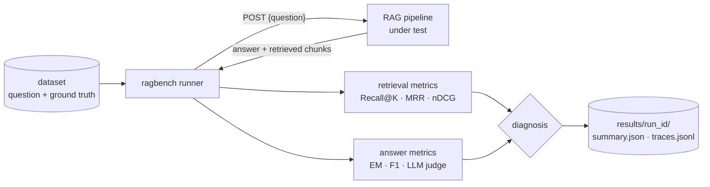

# ragbench + FinanceBench

**Measure a document-QA / RAG pipeline objectively, and find out _why_ it fails.**

This repository contains two independent pieces:

| | What it is | Where |
|---|---|---|
| **ragbench** | A benchmark runner that calls any RAG pipeline over HTTP, scores retrieval and answers, keeps a full trace per question and tells retrieval failures apart from generation failures. | `ragbench/`, `benchmark.py` |
| **FinanceBench V1.1** | An English financial QA benchmark: 120 independently checked questions over a frozen corpus of 17 public financial PDFs (1,995 pages), with evidence pointing to the original document and page, a short natural phrasing and key facts for deterministic scoring. | `finance_benchmark/` |

The runner contains no RAG pipeline, and the dataset was built without using the pipeline it will evaluate.

---

## The question it answers

> When the system gives a wrong answer, did it **not find** the information, or **not use** it correctly?



| evidence retrieved? | answer | diagnosis |
|---|---|---|
| no | wrong | `RETRIEVAL_FAILURE` — the information was not found |
| yes | wrong | `GENERATION_FAILURE` — it was found but not used correctly |
| — | right, not supported by the retrieved text | `GROUNDING_FAILURE` (needs the judge) |
| — | right | `SUCCESS` |
| — | HTTP error / timeout / invalid payload | `PIPELINE_ERROR` |

Unanswerable questions have nothing to retrieve: answering "this cannot be established" is a success, an invented
answer is a `GENERATION_FAILURE`. Every report ends with the 2×2 table *evidence retrieved × answer correct* and the
share of wrong answers caused by retrieval vs generation.

---

## Quickstart (2 minutes, no API key)

```bash
pip install -r requirements.txt pytest
python examples/mock_pipeline.py --port 8000 &            # a toy BM25 pipeline exposed over HTTP

python benchmark.py run --dataset datasets/sample.jsonl --config configs/pipeline.yaml --run-id demo
python benchmark.py report  --run demo
python benchmark.py analyze --run demo --metric token_f1 --worst 5
python -m pytest                                          # 63 tests
```

```
RETRIEVAL                          WHY DO ANSWERS FAIL?
Recall@1        0.77                                 answer correct  answer wrong
Recall@5        1.00               evidence retrieved             6             4
MRR             0.95               evidence missing               0             0
QA                                 Accuracy when evidence retrieved : 60%
Exact Match     0.00               Wrong answers (4): 0% retrieval failure, 100% generation failure
Token F1        0.54
```

`datasets/sample.jsonl` is a 10-question **synthetic** toy set (fictional companies) used for smoke tests only.

---

## Using FinanceBench with your own runner

`finance_benchmark/datasets/financebench_v1_simple.jsonl` (and `.csv`) gives one row per question with only what an external
runner needs:

| column | content |
|---|---|
| `id` | `fin_q_NNN` |
| `question` | explicit question (entity, period and basis stated) |
| `question_natural` | the same question as a user would type it (median 18 words vs 38) |
| `answer` | reference answer |
| `documents` | PDF file name(s) in `finance_benchmark/corpus/documents/` that hold the answer (empty for unanswerable questions) |
| `pages` | `fin_doc_011.pdf:162` per evidence item (1-based PDF page) |
| `answerable` | `false` for the 10 questions whose expected answer is an abstention |

Regenerate it with `python finance_benchmark/tools/export_simple.py`. The full annotation (verbatim evidence, calculations, key
facts, metadata) stays in `finance_benchmark/datasets/finance_benchmark_v1.jsonl`.

## Run FinanceBench with ragbench (e.g. against the Prosperify API)

1. **Ingest** `finance_benchmark/corpus/documents/fin_doc_001.pdf … fin_doc_017.pdf` into the pipeline, keeping the
   file name (or `fin_doc_NNN`) as the document id and the page number of every chunk.
2. **Expose** an HTTP endpoint that follows the contract below.
3. **Run**:

```bash
export PIPELINE_URL=https://…/query PIPELINE_TOKEN=… ANTHROPIC_API_KEY=…
python benchmark.py run --dataset finance_benchmark/datasets/finance_benchmark_v1.jsonl \
                        --config configs/financebench.yaml --run-id prosperify_v1
python benchmark.py analyze --run prosperify_v1 --failure-type RETRIEVAL_FAILURE
python benchmark.py compare prosperify_v1 prosperify_v2
```

### HTTP contract

`POST <endpoint>` with `{"question": "..."}` → `200`:

```json
{
  "answer": "DHL Group's effective tax rate for 2025 was 29.4%.",
  "retrieved_chunks": [
    {"chunk_id": "c_8812", "text": "…Profit before income taxes 5,062 5,246…", "score": 12.3,
     "document_id": "fin_doc_011.pdf", "page": 162, "page_end": 162}
  ]
}
```

- Order of `retrieved_chunks` = ranking of the retriever. A chunk may also be a bare id string.
- Accepted aliases: `id`, `content`, `doc_id` / `source`, `page_number`. Field names of the payload are configurable.
- `text` is needed by the judge (groundedness); `document_id` + `page` let the runner match the annotated evidence.
  Without pages, a chunk matches an evidence item when it contains most of the evidence text.
- Errors are isolated per question: timeout, retries with backoff on network/408/425/429/5xx (never on other 4xx),
  invalid payload → `PIPELINE_ERROR`, metrics at 0, the run continues.

---

## Ground truth formats

One JSONL line per question. Two formats are accepted, so the same runner serves both datasets:

```jsonc
// chunk ids (tied to one chunking of the corpus) — datasets/sample.jsonl
{"id": "q_001", "question": "…", "reference_answer": "…", "relevant_chunks": ["alpha_2025_chunk_001"]}

// evidence in the original documents (independent of chunking) — FinanceBench
{"id": "fin_q_011", "question": "…", "reference_answer": "…",
 "evidence": [{"document_id": "fin_doc_011", "page": 162, "text": "Profit before income taxes 5,062 5,246 …"}],
 "metadata": {"type": "calculation", "style": "lookup", "answerable": true, "…": "…"},
 "calculation": {"inputs": {"…": 0}, "operation": "…", "result": 0.2936}}
```

Unanswerable questions carry `"answerable": false` (top level or in `metadata`) and no evidence. Optional fields:
`question_natural` (a short user-style phrasing; run it with `question_field: question_natural` in the config) and
`key_facts` (`[{"fact": "…", "value": "29.4%", "accept": ["29.36%"]}]`, the values a correct answer must contain).

## Metrics

| Family | Metrics | Notes |
|---|---|---|
| Retrieval | Recall@K, MRR (default) · Precision@K, nDCG@K | duplicates count once; averaged over answerable questions |
| Answer, deterministic | Exact Match, Token F1 · key-fact recall, all key facts present | normalised (case, accents, punctuation, articles); key facts match numbers on number boundaries (`4.5%` ≠ `14.5%`), with accepted variants |
| Answer, LLM judge | correctness, completeness, groundedness ∈ [0, 1] + reason | JSON validated by Pydantic; provider `anthropic` or `openai_compatible`; the evaluated answer is treated as data, not instructions |
| Latency | mean, p50, p95 | successful calls only |

Answer correctness = judge `correctness ≥ 0.5` when the judge is on; without judge: an explicit abstention ("cannot be
established…") for unanswerable questions, else all key facts present when the sample has key facts, else Token F1 ≥ 0.5
(thresholds configurable). The trace records which rule decided.
Adding a retrieval metric = one function on `(hits, n_relevant, k)` in `ragbench/evaluation/retrieval.py`.

## CLI

| Command | Purpose |
|---|---|
| `run --dataset D --config C [--run-id ID] [--limit N] [--no-judge]` | run, write `results/<run_id>/summary.json` + `traces.jsonl` |
| `report --run ID` | retrieval, QA, judge, latency, diagnosis, 2×2 failure table |
| `analyze --run ID [--metric M] [--worst N] [--failure-type T]` | worst traces with question, expected evidence, top-5 chunks, judge reason |
| `compare A B` | metric deltas between two runs (warns when the dataset hash differs) |

Each run records `run_id`, timestamp, pipeline name/version, dataset name/version/**SHA-256**, and the full configuration
(header values masked). `${VAR}` in YAML is read from the environment, so no secret lives in the config.

---

## FinanceBench V1.1 at a glance

- **Corpus (frozen, SHA-256 per file):** ECB annual accounts · Belfius Bank Pillar 3, EMTN base prospectus, FY2025 results release ·
  Belfius Insurance SFCR · ASN Bank Pillar 3 · M&G/PIA SFCR · Central Bank of Türkiye · Luzerner Kantonalbank · CBA Europe Pillar 3 ·
  Guggenheim UCITS annual report and prospectus · Fresenius consolidated statements and Q4/FY2025 release · DHL annual reports 2025 and 2024 ·
  AMF (French markets regulator) 2025 annual report.
- **120 questions** — types: table 36 · calculation 17 · multi-evidence 14 · temporal 13 · unanswerable 10 · direct 9 · multi-document 9 ·
  definition 6 · risk 6; forms: lookup 32 · comparison 21 · explanatory 17 · yes/no 13 · superlative 12 · list 7 · ranking 6 · trend 4 ·
  conditional 4 · count 4. 25 require a calculation. Every question has a natural phrasing; every answerable one has 1–8 key facts (unanswerable ones are scored on abstention).
- **Negatives:** 10 unanswerable questions over 6 patterns (period after the report date, entity not in the corpus, metric the
  document does not publish, figure merged into another line, unpublished granularity, absent limit) + 3 false-premise questions
  whose correct answer corrects the premise.
- **Validation:** annotation by model agents → automatic checks (every evidence quote verbatim on its page, every calculation
  recomputed, units checked) → **blind re-answer** by separate agents → adjudication of every disagreement against the source
  of every disagreement against the source. A relevance review then scored every question (mean 3.63/5): 13 near-duplicate or
  low-value questions retired, 18 rewritten and re-verified the same way. **No human review yet:** `datasets/human_review_priority.json`
  lists the 20 questions to read first.
- **Missing:** a French Universal Registration Document (the issuer's domain is blocked by this environment's network policy).

Dataset card, document table, protocol and limits: **[finance_benchmark/README.md](finance_benchmark/README.md)**.

---

## Repository layout

```
benchmark.py                  CLI entry point (→ ragbench/cli.py)
ragbench/
  models.py                   Pydantic structures (Sample, EvidenceRef, PipelineResult, Trace, Summary…)
  config.py · dataset.py      YAML config and JSONL dataset loading/validation
  runner.py                   dataset → pipeline → metrics → diagnosis → traces
  storage.py                  results/<run_id>/ (incremental traces, read back)
  pipelines/                  base.py (PipelineAdapter), http.py (HTTPPipelineAdapter)
  evaluation/                 retrieval.py, qa.py, judge.py, diagnosis.py
  reporting/                  aggregator.py, report.py, analyze.py
configs/                      pipeline.yaml (mock demo), financebench.yaml (real pipeline + judge)
datasets/                     sample.jsonl + sample_corpus.jsonl (synthetic toy set for the mock pipeline)
examples/mock_pipeline.py     toy BM25 pipeline over HTTP (does not import ragbench)
finance_benchmark/            FinanceBench: corpus/, datasets/ (incl. simple export), annotation/ (audit trail), tools/, guide
tests/                        63 tests (metrics, judge, HTTP adapter, runner, evidence matching, CLI end-to-end, dataset tools)
```

## Known limits

- Sequential execution, no resume after interruption (traces already written are kept).
- The Anthropic / OpenAI-compatible judge clients are only tested with a fake client.
- No confidence intervals between runs: on ~100 questions, small differences are not significant.
- FinanceBench reference answers are long and often answer several sub-questions: score them with the judge or the key facts, not EM/F1.
